**POST RUN WRF**

**Descripción**

Este **repositorio** alberga una serie de proyectos desarrollados en un **entorno** **virtual** utilizando **Visual** **Studio** (**VS**) y el lenguaje de programación **Python**. Su propósito principal es mejorar y optimizar la generación de mapas, así como la extracción y procesamiento de datos, con un enfoque particular en el uso de información proporcionada por el modelo **meteorológico** **WRF** (**Weather Research and Forecasting**).

El repositorio incluye varios módulos clave que ofrecen funcionalidades específicas:

- **wind\_wrf\_gfs**: Analiza y procesa datos de viento utilizando las salidas de **WRF** y **GFS** para generar representaciones visuales o cálculos personalizados.
- **generate\_map**: Genera mapas detallados a partir de los datos **meteorológicos** y **geográficos** procesados.
- **generate\_json\_DoD**: Automatiza la creación de archivos **JSON** con información estructurada basada en datos del **Departamento de Defensa** (**DoD**).
- **generate\_json\_FAA**: Similar al módulo anterior, pero orientado a datos de la **Administración Federal de Aviación (FAA).**
- **search\_by\_icao**: Permite realizar búsquedas de datos específicos utilizando códigos **ICAO**.
- **search\_by\_FAA\_icao**: Facilita la búsqueda de información usando combinaciones de códigos **FAA** e **ICAO**.

Adicionalmente, el repositorio incluye los siguientes archivos esenciales para su correcta configuración y funcionamiento:

- **main.py**: Archivo principal que sirve como punto de entrada al proyecto, facilitando la ejecución de las funcionalidades de los módulos mencionados.
- **setup.ini**: Archivo de configuración que define rutas importantes para el entorno de ejecución.
- **requirements.txt:** Documento que especifica las dependencias necesarias para ejecutar el proyecto, permitiendo la instalación rápida y eficiente de las bibliotecas requeridas.

**Nota: Este proyecto está diseñado para usuarios interesados en el análisis meteorológico, la generación de mapas personalizados y la manipulación avanzada de datos meteorológicos y geoespaciales. Además, su estructura modular permite una fácil personalización y extensión para adaptarse a nuevas necesidades.**

**Tabla de Contenidos**

- Descripción
- Instalación
- Uso
- Contribuciones
- Licencia

**Instalación**
Sigue estos pasos para instalar y configurar el proyecto:

**1.** **Clonación del repositorio**

**2.** git clone [**https://github.com/Neroneitor/post_run_wrf.git**](https://github.com/Neroneitor/post_run_wrf.git)

-  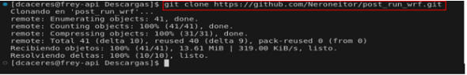

**3**. **Ingreso al entorno virtual global** Asegúrate de tener configurado tu entorno virtual global (**global\_post\_env)** y actívalo
c
  **Paso 1**: Ingreso y Activación de Conda en la Terminal

  - Abrir la terminal: Accede a la terminal desde tu sistema operativo.
  - Activar Conda: Ingresa el comando para activar Conda: “**conda acitvate**” 

 -  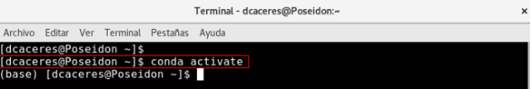

**Nota: Asegúrate de que Conda esté correctamente instalado y configurado previamente.**

- Si el entorno **Conda** se activó correctamente, antes de nuestro nombre aparecerá "**(base)**", lo que indica que estamos dentro del entorno base de **Conda**.

- 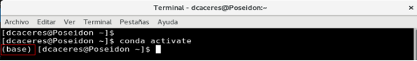

**Paso 2**: Búsqueda de entornos virtual (**global\_post\_env**)

- Utiliza el comando de terminal “**conda env** **list**” para visualizar todos los entornos virtuales disponibles en tu equipo.
- 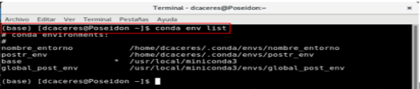

- Buscaremos en la lista de nombres el entorno virtual global denominado "**global\_post\_env**".

- 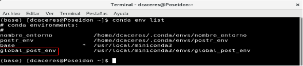

**Paso 3:** activación de entorno virtual (**global\_post\_env**)

- Para activar el entorno virtual, utilizaremos el comando "**conda activate**" seguido de la ruta de nuestro entorno.
- 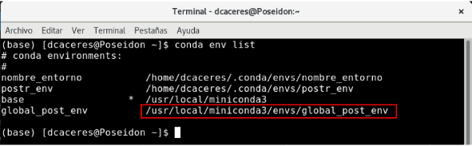

- En comando debería quedar de la siguiente manera **“conda activate /usr/local/miniconda 3/envs/global\_post\_env”** 
- 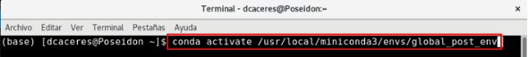

- Luego de hacer este paso nuestro entorno quedara activado de manera correcta, para verificar esto el **“(base)”** cambiara por el nombre de nuestro entorno (**global\_post\_env**)
- 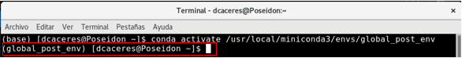

**Nota: Este entorno ya tiene las librerías necesarias, según el archivo requirements.txt, lo que asegura que el proyecto esté completamente operativo para su diseño y desarrollo. En caso de que el entorno virtual global no esté disponible o no funcione correctamente, puedes crear un entorno virtual específico para este proyecto. A continuación, se detallará el proceso de creación del entorno virtual e instalación de las librerías, en caso de que el entorno 'global\_post\_env' no sea funcional**

**Paso 1**: Usaremos el comando **“python3.10 -m venv”** para crear nuestro entorno virtual. En este caso, el entorno se llamará “**post\_env”**.
- 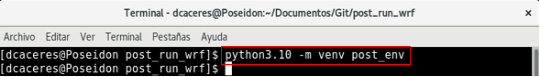

**Paso 2:** Activar el entorno virtual utilizando el comando: **“source  post\_env/bin/actívate”**

- 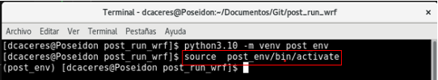

- Si el entorno virtual se activó correctamente, el nombre del entorno aparecerá entre paréntesis, por ejemplo, **(post\_env).
- 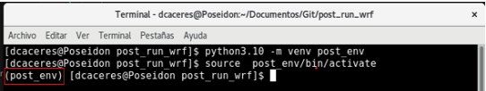

**Paso 3**: Verifica las librerías instaladas de manera predeterminada utilizando el comando: **“pip list”**.
- 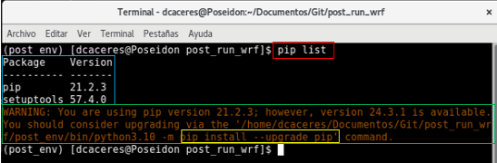

- En este punto, aparecerá un mensaje de advertencia ("**WARNING**") que nos indicará la necesidad de actualizar una de las librerías predeterminadas. Para hacerlo, debemos ejecutar el siguiente comando**:  "pip install --upgrade pip ".**
- En la siguiente imagen, se muestra cómo debería lucir el proceso correctamente.

- 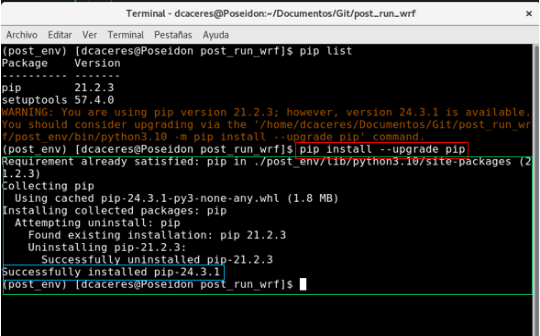

**Paso 4:** En este paso, instalaremos las librerías necesarias para ejecutar el proyecto. Los nombres y versiones específicas requeridas para su correcto funcionamiento están detallados en el archivo denominado ***requirements.txt.*** Para instalarlas, utiliza el siguiente comando: **"pip install -r requirements.txt "**

- 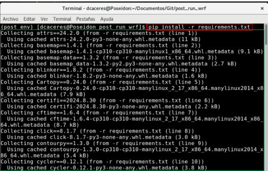

- Una vez que se complete la instalación de las librerías, se mostrarán dos mensajes principales en la salida del proceso: el primero será **'Installing collected packages'**, lo que indica que los paquetes se están recopilando y preparando para su instalación. El segundo mensaje será **'Successfully installed'**, lo que confirma que la instalación de las librerías se ha realizado con éxito

- "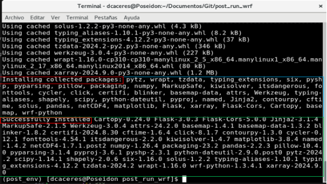"

**Paso 5**: Por último, ejecutamos el archivo principal (**main**) del proyecto. Cabe destacar que este ejemplo se realizó desde la terminal del sistema operativo, pero también es posible hacerlo desde la terminal integrada de **Visual Studio (VS)**.

- "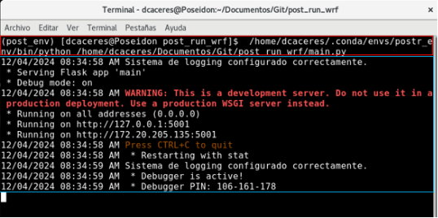"

4. **Creación de carpeta para resultados** Para almacenar los archivos generados, crea una carpeta en el directorio principal del proyecto utilizando el comando **“mkdir documents\_post\_run”**. Alternativamente, puedes ir directamente a la ubicación donde clonaste el repositorio de GitHub y crear manualmente la carpeta **“documents\_post\_run”**. Esta carpeta está definida en el archivo setup.ini como el contenedor principal de todos los resultados generados por los procesos.
- En la siguiente imagen se muestra cómo debería quedar organizada la carpeta creada.
- 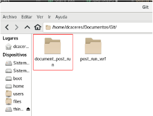

- En la imagen siguiente se muestra la visualización del archivo setup.ini, donde se redirigen los resultados a la carpeta **'documents\_post\_run'** según los diferentes usos.

- 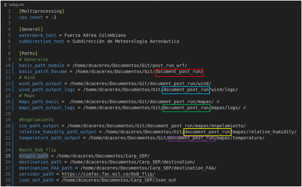

5 **Uso**
El uso del proyecto se realiza mediante métodos **POST** enviados por **Postman**. Sigue estos pasos:

1. Asegúrate de haber completado los pasos de instalación.
2. Ejecuta el archivo principal del proyecto: python **main.py**
3. Utiliza Postman para enviar solicitudes al servidor configurado.

   3\.1 paso a paso para el uso y envió de solicitudes: 

   **Paso 1:** Ingresar al **Main** y buscar el **Endpoint** que vamos a utilizar. En este caso, como ejemplo, utilizaremos el **Endpoint** de Búsqueda por **ICAO**.

- 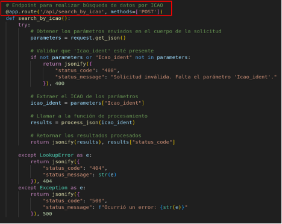

**Paso 2**: Después de completar el **paso 1**, nos ubicaremos en la línea de código que inicializa el fragmento de código

- 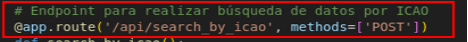

En esta parte, se encuentra la ruta **'/api/search\_by\_icao'**, a la cual se accederá mediante el método **POST**.

**Paso 3**: Una vez obtenida esta información, nos dirigimos a Postman, donde crearemos una nueva colección haciendo clic en el signo de más (+).

- 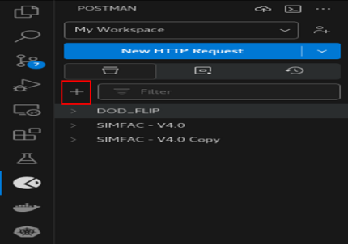

Esto creará una nueva colección en la que trabajaremos nuestras solicitudes al **Endpoint**. Por defecto, la colección llevará el nombre **'New** **Collection'**. Luego de crearla, haremos **clic** derecho sobre el nombre para abrir las opciones de la colección. Esto desplegará una lista de opciones, de la cual seleccionaremos **'Add** **Request'**. Esto creará el espacio donde trabajaremos nuestra solicitud.

- 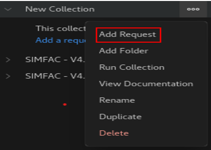

La cual se vería así:

- 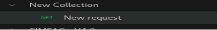

Haremos **clic** en este nuevo objeto, lo cual abrirá un formulario donde ingresaremos la información de nuestra solicitud

- 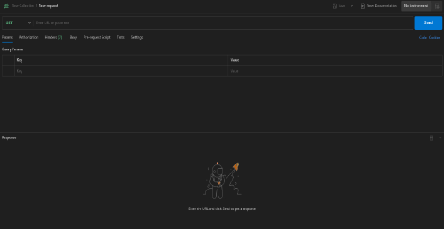

- **Paso** **4**: En este nuevo formulario, realizaremos la preparación necesaria para ejecutar nuestra solicitud.
-

• **Paso 4.1** Ingresar la ruta junto con el puerto en el que se está trabajando, el cual generalmente se encuentra al final del archivo **Main**.

- **Puerto** en el que se está trabajando:
- 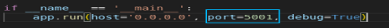
  

- **Ruta** del **Endpoint** en cual vamos a acceder:
- 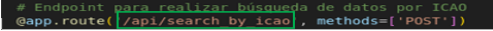
 

- **Método** del **Endpoint** en cual vamos a acceder:
- 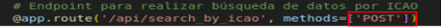

- Además, se deberá solicitar al administrador la **URL** (en este caso, el ejemplo es **http://127.0.0.1:**) para poder continuar con el proceso. El resultado de este proceso debería ser el siguiente:
- 

Para cambiar el método, debemos hacer clic en el método y seleccionar el que ya está previamente definido en el **Endpoint**.

Paso 5: seleccionaremos la opción de **'Body'**.
- 

Después de esto, seleccionaremos la opción **'Raw'**, lo cual habilitará un campo en el que podremos ingresar los datos y la clave a seleccionar.

- 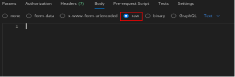

- En este campo ingresaremos los datos y la forma en la que los vamos a buscar.

- 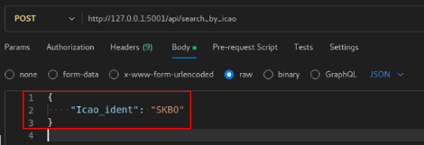

El resultado final se mostrará de la siguiente manera después de ejecutar los pasos descritos anteriormente. (**Este proceso ha sido tomado como ejemplo del proceso de búsqueda por ICAO en la API, enfocado en la organización y búsqueda de documentos DOD\_FLIP.**)

- 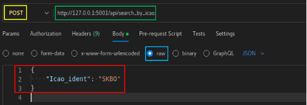

A continuación, se enviará el método **POST** para ejecutar las funciones mencionadas

- 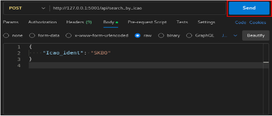

Así es como se verá el **módulo** cuando los resultados del proceso estén listos al finalizar la ejecución

- 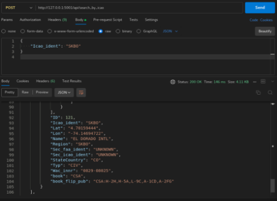

1. Los mapas generados se almacenarán en la **carpeta documents\_post\_run**. Esto aplica a todos los archivos resultantes de la ejecución de los generadores de mapas.

5 **Contribuciones**
¡Las contribuciones son bienvenidas! Si deseas contribuir al proyecto:

1. Realiza un **fork** del repositorio.
- Crea una rama para tu contribución:
- **git checkout -b mi-nueva-funcionalidad**

1. Realiza tus cambios y confirma los **commits**:
- **git commit -m** **"**Agrega mi nueva funcionalidad**"**
- Envía un **pull push origin** mas el nombre de tu rama.

**Licencia**
Este proyecto está bajo la licencia MIT License.
